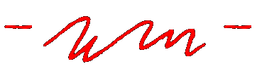

<!-- _coverpage.md -->

<!-- 背景图片-->

  

<!---->

<h1 style="color: #ffffff">自律给我自由</h1>
<!--
wm个人博客
-->

<!-- 自律给我自由 <small>wm</small>-->

<blockquote>
  
wm个人博客

</blockquote>

<ul style="color:#fff">
  <li>每一次、一步、一公里的累计</li>
  <li>都是对自由的执着与期待</li>
</ul>

<!-- [GitHub](#) -->
<!-- [Get Started](base-quickstart.md) -->

  <a href="#/base-quickstart">
    
  </a>

<!-- 背景色 -->

<!---->

